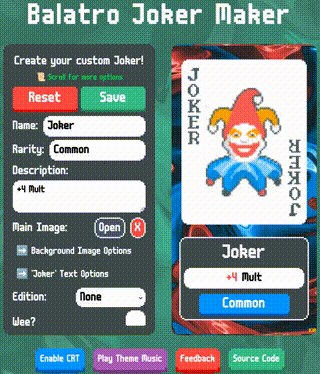

<!-- https://github.com/othneildrew/Best-README-Template -->

<!-- PROJECT LOGO -->
 

  

<h3 align="center">Balatro Joker Maker</h3>

  

    A simple and stylized way to make custom jokers for Balatro
     

<!-- TABLE OF CONTENTS -->
# Links
* [About The Project](#about-the-project)
  * [Built With](#built-with)
* [Installation](#installation)
* [Contributing](#contributing)
* [License](#license)
* [Contact](#contact)
* [Acknowledgements](#acknowledgements)

<!-- ABOUT THE PROJECT -->
# About The Project

This is a simple custom joker maker for [Balatro](https://en.wikipedia.org/wiki/Balatro) written in TypeScript + React. More features are planned!

(<a href="#readme-top">back to top</a>)

  

## Built With

    

(<a href="#readme-top">back to top</a>)

<!-- GETTING STARTED -->
# Installation

1. Clone the repository
2. Run `npm install`
3. Run `npm run dev`
4. Go to `https://localhost:5173` in your browser

(<a href="#readme-top">back to top</a>)

<!-- CONTRIBUTING -->
# Contributing

Contributions are what make the open source community such an amazing place to learn, inspire, and create. Any contributions you make are **greatly appreciated**.

If you have a suggestion that would make this better, please fork the repo and create a pull request. You can also simply open an issue with the tag "enhancement".
Don't forget to give the project a star! Thanks again!

1. Fork the Project on Github
2. Create your Feature Branch (`git checkout -b feature/AmazingFeature`)
3. Commit your Changes (`git commit -m 'Add some AmazingFeature'`)
4. Push to the Branch (`git push origin feature/AmazingFeature`)
5. Open a Pull Request on Github
 

(<a href="#readme-top">back to top</a>)

## Top contributors:

<!-- LICENSE -->
# License

Distributed under the GPL 3.0 License. See LICENSE for more information.

(<a href="#readme-top">back to top</a>)

<!-- CONTACT -->
# Contact

Musa Ahmed - [musaa.ahmed7@gmail.com](mailto:musaa.ahmed7@gmail.com)

Project Link: [https://github.com/m-GDEV/balatro-joker-maker](https://github.com/m-GDEV/balatro-joker-maker)

(<a href="#readme-top">back to top</a>)

<!-- ACKNOWLEDGMENTS -->
# Acknowledgments

- [Best-README-Template: for this cool template](https://github.com/othneildrew/Best-README-Template)
- [Font used on jokers in Balatro](https://fontstruct.com/fontstructions/show/2622222/jokerfontbalatro)
- [Main Balatro font](https://managore.itch.io/m6x11)
- [Balatro calculator that had joker edition assets (polychrome overlay, etc)](https://efhiii.github.io/balatro-calculator/?h=IADaG0NobQoAChiDFnUzqZ1A)
- [Balatro joker maker on Figma with useful assets (background, etc)](https://www.figma.com/community/file/1455582433281954119/balatro-build-your-own-joker)
- [Pixelated corner effect in CSS](https://pixelcorners.lukeb.co.uk/?radius=6&multiplier=3&border=1&border_width=1&border_color=#ffffff)

(<a href="#readme-top">back to top</a>)

